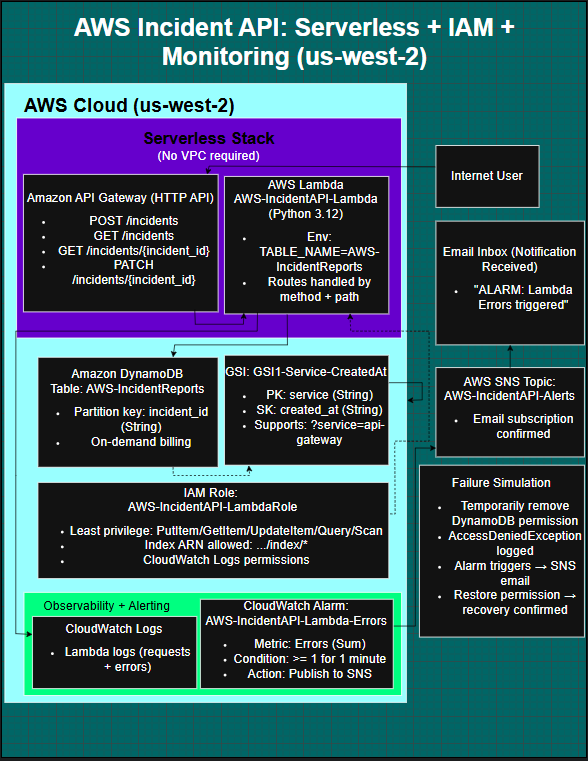

# AWS Serverless Incident API

A serverless incident logging API built on AWS using **API Gateway (HTTP API)**, **AWS Lambda (Python 3.12)**, and **DynamoDB**. The project includes observability with **CloudWatch Logs**, alerting with **CloudWatch Alarms + SNS email**, and a documented failure simulation to validate monitoring and least-privilege IAM behavior.

## Architecture

**Request flow**
- Client (curl/Postman)  
  → API Gateway (HTTP API)  
  → Lambda (Python)  
  → DynamoDB (IncidentReports table + optional GSI)

**Observability & alerting**
- CloudWatch Logs (Lambda logs)
- CloudWatch Alarm (Lambda Errors / Throttles)
- SNS Topic → Email subscription

**Diagram**
- 

## AWS Resources (as deployed)

**Region:** us-west-2

### API Gateway (HTTP API)
- **Name:** AWS-IncidentAPI-HTTP
- **Routes:**
  - `POST /incidents`
  - `GET /incidents`
  - `GET /incidents/{incident_id}`
  - `PATCH /incidents/{incident_id}`

### Lambda
- **Function:** AWS-IncidentAPI-Lambda
- **Runtime:** Python 3.12
- **Env vars:**
  - `TABLE_NAME=AWS-IncidentReports`

### DynamoDB
- **Table:** AWS-IncidentReports
- **Partition key:** `incident_id` (String)
- **Billing:** On-demand

**Optional query optimization (recommended)**
- **GSI:** `GSI1-Service-CreatedAt`
  - Partition key: `service` (String)
  - Sort key: `created_at` (String)
- Enables: `GET /incidents?service=<service-name>`

### IAM (least privilege)
- **Execution role:** AWS-IncidentAPI-LambdaRole
- **DynamoDB permissions** (scoped to table + index ARN)
  - `dynamodb:PutItem`
  - `dynamodb:GetItem`
  - `dynamodb:Scan`
  - `dynamodb:Query`
  - `dynamodb:UpdateItem`
- **CloudWatch Logs permissions**
  - `logs:CreateLogGroup`
  - `logs:CreateLogStream`
  - `logs:PutLogEvents`

### Monitoring
- **Alarm:** AWS-IncidentAPI-Lambda-Errors  
  - Metric: `AWS/Lambda Errors`  
  - Threshold: `>= 1` (1 minute)  
  - Action: SNS publish → email notification  
- **Alarm (optional):** AWS-IncidentAPI-Lambda-Throttles  
  - Metric: `AWS/Lambda Throttles`  
  - Threshold: `>= 1`

### SNS
- **Topic:** AWS-IncidentAPI-Alerts
- **Subscription:** email (confirmed)

## API

### Create an incident
`POST /incidents`

Example request body:
```json
{
  "title": "ALB 502 errors",
  "severity": "HIGH",
  "service": "api-gateway",
  "description": "Spike in 502 responses observed.",
  "reported_by": "steven",
  "environment": "prod"
}